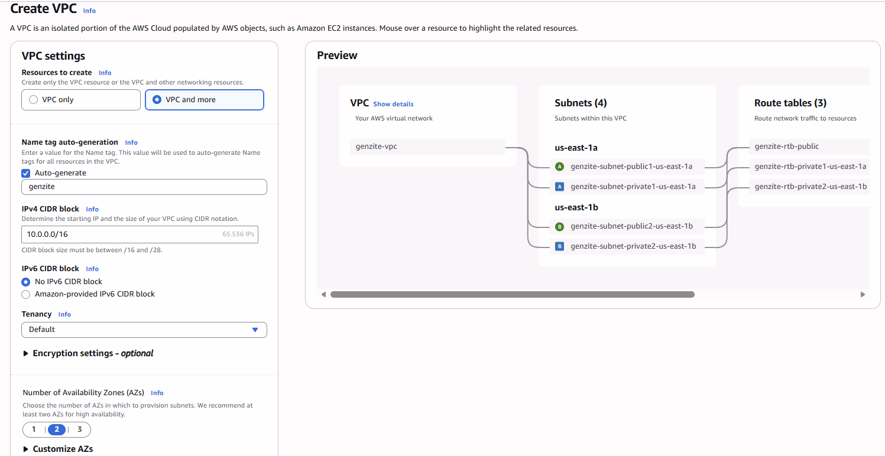
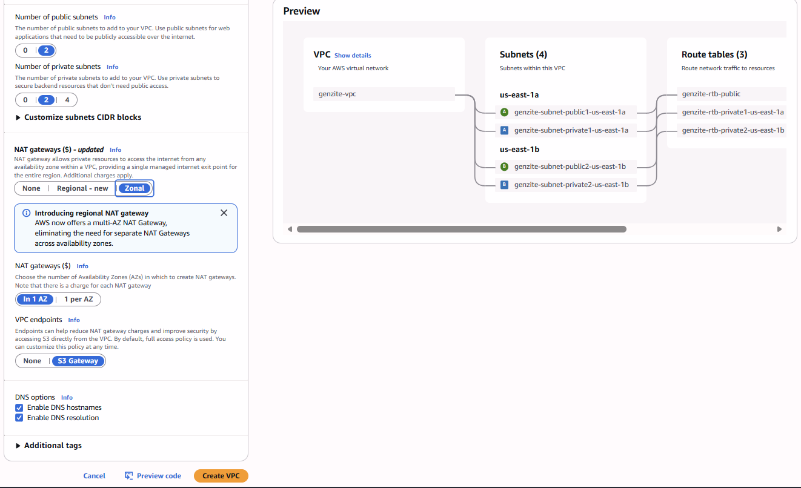
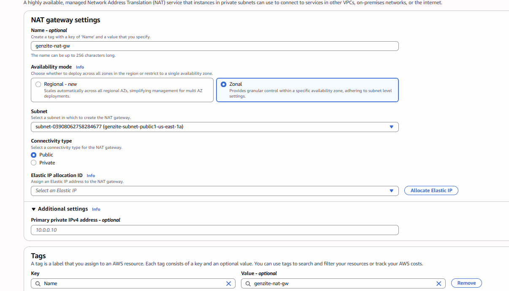

Trong phần này, chúng ta sẽ tạo và cấu hình Virtual Private Cloud (VPC) cho hạ tầng của mình. Việc tạo VPC đóng vai trò nền tảng mạng (network foundation) để triển khai các dịch vụ như EC2 một cách an toàn.

## Mục tiêu
- Tạo một VPC tuỳ chỉnh với dải mạng (CIDR) là `10.0.0.0/16`.
- Cấu hình 2 Public Subnet và 2 Private Subnet trải rộng trên 2 Availability Zone.
- Thiết lập Internet Gateway (IGW) cho phép Public Subnet truy cập internet.
- Thiết lập NAT Gateway để Private Subnet có thể truy cập ra internet an toàn.
- Thiết lập S3 Gateway Endpoint để truy cập dịch vụ S3 trực tiếp từ VPC mà không qua internet.

## Bước 1: Tạo VPC

1. Truy cập vào **AWS Management Console**.
2. Tìm kiếm dịch vụ **VPC** trên thanh công cụ tìm kiếm và chọn **VPC**.
3. Ở menu bên trái, chọn **Your VPCs**.
4. Nhấn nút **Create VPC** ở góc trên bên phải.
5. Cấu hình các thông số theo đúng 2 hình minh hoạ dưới đây:
   - **VPC settings**: Chọn **VPC and more** (để tạo luôn Subnet, Route Table và Gateway).
   - **Name tag auto-generation**: Nhập tên VPC của bạn là `genzite`.
   - **IPv4 CIDR block**: `10.0.0.0/16`.

   - **Number of Availability Zones (AZs)**: `2`.
   - **Number of public subnets**: `2`.
   - **Number of private subnets**: `2`.
   - **NAT gateways ($)**: Chọn **Zonal** và **In 1 AZ** (Để tạo NAT Gateway cho Private Subnet).
   - **VPC endpoints**: Chọn **S3 Gateway**.
   - **DNS options**: Đảm bảo đã tích chọn **Enable DNS hostnames** và **Enable DNS resolution**.

6. Kiểm tra lại cấu hình ở khung preview bên phải và nhấn nút **Create VPC**.

### Khởi tạo NAT Gateway
Trong trường hợp bạn chọn **None** ở phần NAT gateways khi tạo VPC (để tiết kiệm chi phí ban đầu) và muốn tạo lại thủ công ở các Lab sau, hãy làm theo các bước sau:

1. Truy cập dịch vụ **VPC**, chọn **NAT gateways** ở menu bên trái.
2. Nhấn **Create NAT gateway**.
3. Cấu hình theo thông số sau:
   - **Name**: `genzite-nat-gw`
   - **Availability mode**: `Zonal`
   - **Subnet**: Chọn Public Subnet của bạn (ví dụ: `genzite-subnet-public1-us-east-1a`)
   - **Connectivity type**: `Public`
   - **Elastic IP allocation ID**: Nhấn nút **Allocate Elastic IP**

4. Nhấn **Create NAT gateway** và đợi vài phút để trạng thái chuyển sang **Available**.
*(Lưu ý: Nếu tạo thủ công, bạn cần vào Route Table của Private Subnet và trỏ route `0.0.0.0/0` tới NAT Gateway vừa tạo).*

## Bước 2: Kiểm tra lại tài nguyên mạng

Quá trình tạo sẽ mất vài phút do AWS cần thời gian khởi tạo tài nguyên. Khi hoàn tất, hãy kiểm tra:

1. **Subnets**: Đi tới mục **Subnets** ở menu trái và đảm bảo bạn có 2 Public Subnet và 2 Private Subnet được gán với VPC `genzite-vpc`.
2. **Internet Gateways**: Đi tới **Internet Gateways**, đảm bảo có 1 IGW đang ở trạng thái **Attached** vào VPC `genzite-vpc`.
3. **NAT Gateways**: Đi tới **NAT Gateways**, đảm bảo có 1 NAT Gateway đang ở trạng thái **Available**.
4. **Route Tables**: Đi tới **Route Tables**.
   - Cần có 1 Route Table dành cho Public Subnet (dùng chung cho cả 2 AZ, có route `0.0.0.0/0` trỏ tới Internet Gateway).
   - Cần có 2 Route Table dành cho Private Subnet (mỗi AZ 1 Route Table, có route `0.0.0.0/0` trỏ tới NAT Gateway, và có một route đặc biệt trỏ tới S3 Gateway Endpoint).

## Bước 3: Bật tính năng Auto-assign public IPv4 address

Để các EC2 instance khi được tạo trong Public Subnet có thể tự động nhận Public IP, ta cần bật tính năng auto-assign trên Public Subnet.

1. Tại VPC Dashboard, chọn mục **Subnets**.
2. Tích chọn **Public Subnet** của bạn (ví dụ: `genzite-subnet-public1-us-east-1a`).
3. Nhấn vào nút **Actions** -> **Edit subnet settings**.
4. Đánh dấu tích vào ô **Enable auto-assign public IPv4 address**.
5. Nhấn **Save**.

---
**Hoàn tất phần 1!** Bạn đã thiết lập xong mạng cho bài lab. Bước tiếp theo, chúng ta sẽ chuyển sang cấu hình Security (IAM Role & Security Group).
