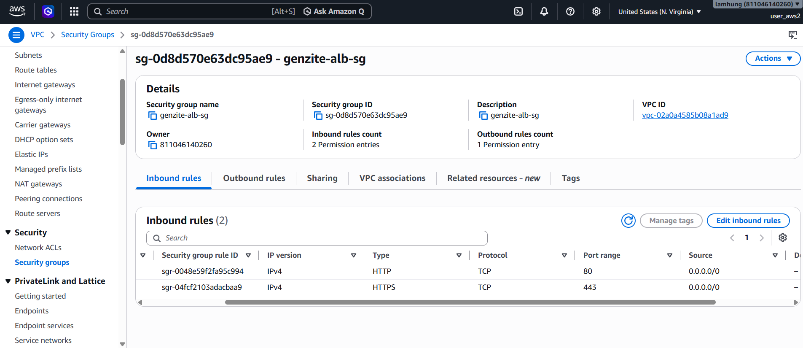

In this section, we will set up security layers to ensure the system is safe, only allowing valid traffic to pass through and granting least-privilege permissions to our services.

## Step 1: Create an IAM Role for EC2

To allow our EC2 (Backend) to send logs to CloudWatch and interact securely with other AWS services without hardcoding API Keys, we will create an IAM Role.

1. Open the **AWS Management Console** and search for **IAM**.
2. In the left menu, select **Roles** and click **Create role**.
3. **Select trusted entity**: Choose **AWS service**.
4. **Use case**: Choose **EC2** and click **Next**.
5. In the Add permissions page, search and select the following policies:
   - `AmazonSSMManagedInstanceCore` (To use Session Manager to securely connect to EC2 instead of opening SSH port 22).
   - `CloudWatchAgentServerPolicy` (To push logs to CloudWatch).
6. Click **Next**.
7. **Role name**: Enter `genzite-role` and click **Create role**.

## Step 2: Create a Security Group for ALB (Internet Facing)

The Application Load Balancer (ALB) will be the direct gateway facing the internet.

1. Navigate to the **EC2** service. In the left menu under Network & Security, select **Security Groups**.
2. Click **Create security group**.
3. **Security group name**: `genzite-alb-sg`.
4. **Description**: `Allow HTTP/HTTPS from Internet`.
5. **VPC**: Select the `genzite-vpc` you created earlier.
6. **Inbound rules**:
   - Add Rule 1: Type `HTTP`, Source `Anywhere-IPv4` (`0.0.0.0/0`).
   - Add Rule 2: Type `HTTPS`, Source `Anywhere-IPv4` (`0.0.0.0/0`).
7. **Outbound rules**: Leave the default (Allow All Traffic).
8. Click **Create security group**.

## Step 3: Create a Security Group for EC2 (Backend)

The EC2 backend should only receive traffic from the ALB and allow you to SSH into it. It should not be directly accessible from the internet to prevent risks.

1. Similarly, click **Create security group**.
2. **Security group name**: `genzite-sg`.
3. **Description**: Optional description, e.g. `genzite-sg created...`.
4. **VPC**: Select `genzite-vpc`.
5. **Inbound rules**:
   - Add Rule 1: Type `Custom TCP`, Port Range `3000`, Source select **Custom** and search for the ALB's SG: `genzite-alb-sg`, Description: `ALB`.
   - Add Rule 2: Type `SSH`, Port Range `22`, Source select **My IP**, Description: `MyIP`.
   - Add Rule 3: Type `Custom TCP`, Port Range `5173`, Source select **Custom** and search for the ALB's SG: `genzite-alb-sg`, Description: `ALB`.
6. **Outbound rules**: Leave the default (Allow All Traffic) to allow downloading libraries and external calls.
7. Click **Create security group**.

## Step 4: Create a Security Group for RDS (Database)

The PostgreSQL Database is a critical asset and should only allow connections from the EC2 backend server.

1. Click **Create security group**.
2. **Security group name**: `genzite-rds-sg`.
3. **Description**: `genzite-rds-sg`.
4. **VPC**: Select `genzite-vpc`.
5. **Inbound rules**:
   - Add Rule 1: Type `PostgreSQL`, Port Range `5432`, Source select **Custom** and search for the EC2's SG: `genzite-sg`.
6. Click **Create security group**.

---
