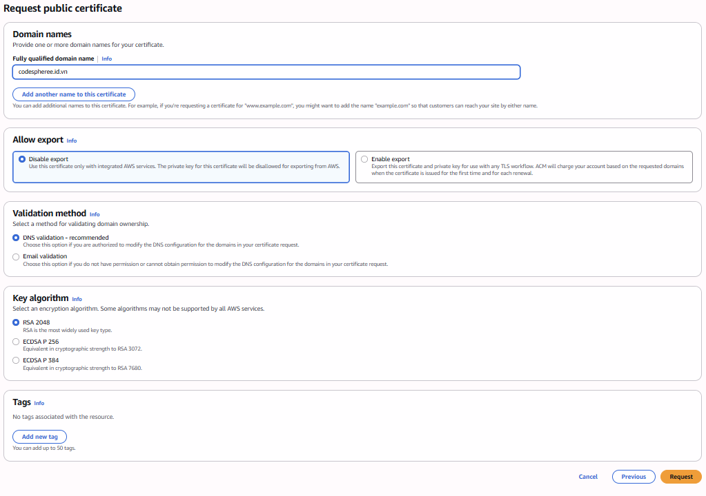
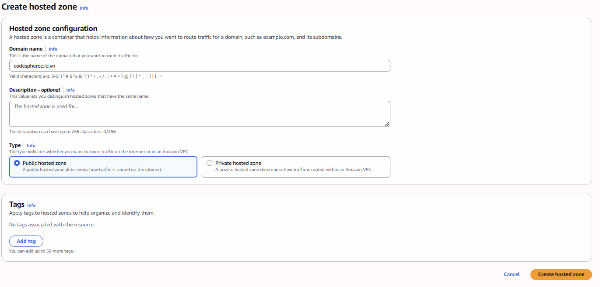

# 5.2.3 Frontend Deployment

For modern frontend applications (like React, Vue, or Angular SPA), deploying to an **Amazon S3 Bucket** behind an **Amazon CloudFront** distribution is the industry best practice. It provides global edge caching, scalability, and built-in DDoS protection.


## Step-by-step Guide

### 1. Build the Frontend Code
First, build your application locally into static assets.

```bash
cd frontend
pnpm install
pnpm run build
```
This will generate a `dist/` or `build/` folder containing your HTML, CSS, and JS files.

### 2. Create an S3 Bucket
1. Go to the **S3 Console**.
2. Click **Create bucket**.
3. **Bucket name**: Choose a globally unique name (e.g., `workshop-frontend-app-12345`).
4. **Block Public Access settings**: Leave "Block all public access" checked (we will use CloudFront OAC to access the bucket securely).
5. Click **Create bucket**.


### 3. Upload Files to S3
1. Click on your newly created bucket.
2. Click **Upload**.
3. Upload all the contents inside the `dist/` or `build/` folder.
4. Click **Upload**.

### 4. Create a CloudFront Distribution
1. Go to the **CloudFront Console**.
2. Click **Create Distribution**.
3. **Origin domain**: Select your S3 bucket.
4. **Origin access**: Select **Origin access control settings (recommended)**.
   - Click **Create control setting** and save.
5. **Default cache behavior**:
   - **Viewer protocol policy**: Redirect HTTP to HTTPS.
6. **Web Application Firewall (WAF)**: Select "Do not enable security protections" (to avoid extra costs).
7. **Default root object**: Enter `index.html`.
8. Click **Create distribution**.

### 5. Update S3 Bucket Policy
CloudFront will generate an S3 bucket policy allowing it to read your bucket.
1. In the CloudFront distribution view, click **Copy policy**.
2. Go back to your S3 bucket > **Permissions** tab.
3. Edit the **Bucket policy** and paste the JSON. Save changes.


### 6. Test the Frontend
Once the CloudFront distribution is deployed, copy the **Distribution domain name** (e.g., `d12345.cloudfront.net`) and paste it into your browser. Your frontend is now live!


### 7. Configure Custom Domain with Route 53 and ACM (Optional)

To use a custom domain name for your application instead of the default CloudFront domain, you need to configure an SSL/TLS certificate using **AWS Certificate Manager (ACM)** and point your DNS record using **Amazon Route 53**.

1. **Request an ACM Certificate**:
   - Go to the **ACM Console** and request a public certificate for your domain name.
   - *Important note: The certificate for CloudFront must be created in the **us-east-1 (N. Virginia)** region.*



2. **Update CloudFront**:
   - Open your CloudFront Distribution, go to **Settings** and click Edit.
   - Add your domain name to the **Alternate domain name (CNAME)** and select the Custom SSL certificate you just created in ACM.

3. **Create Route 53 Record**:
   - Go to **Route 53**, open the Hosted Zone for your domain.
   - Create a new record (Create record), select **A record**, enable the **Alias** toggle, and route traffic to your CloudFront distribution.


