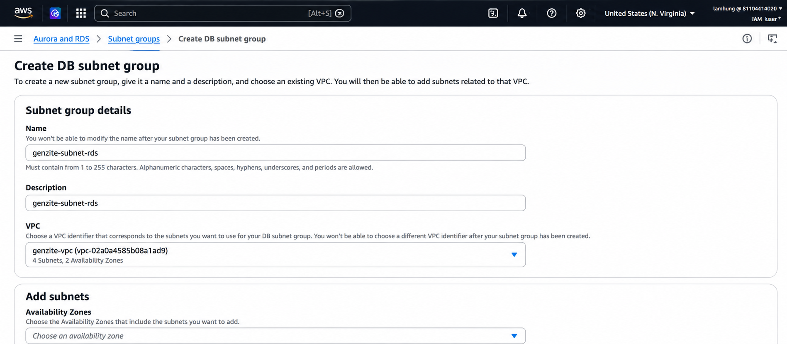
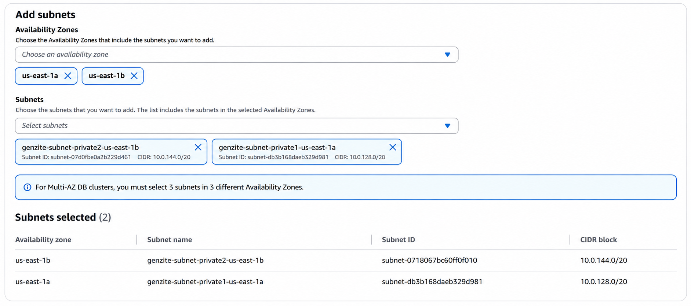
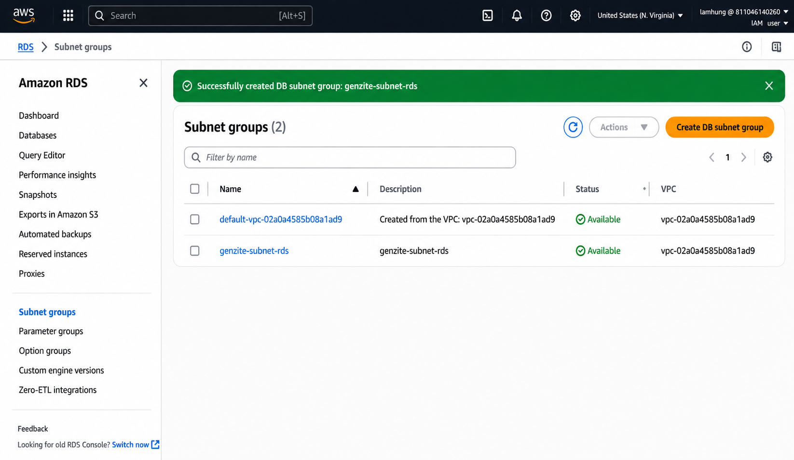
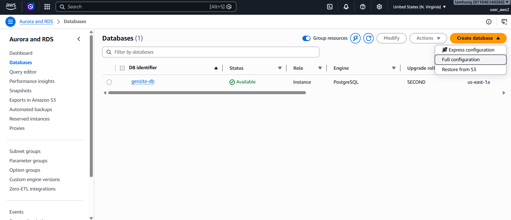
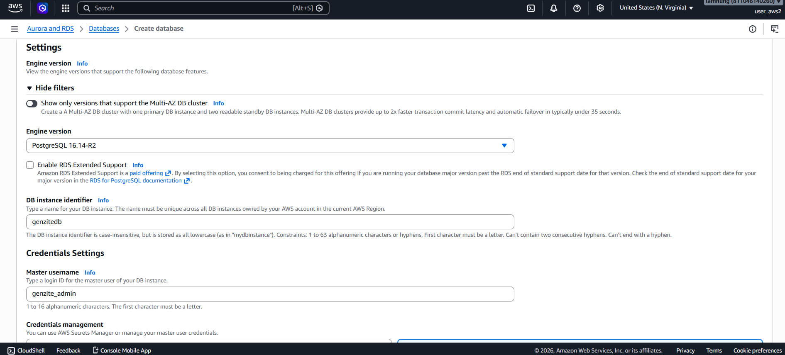
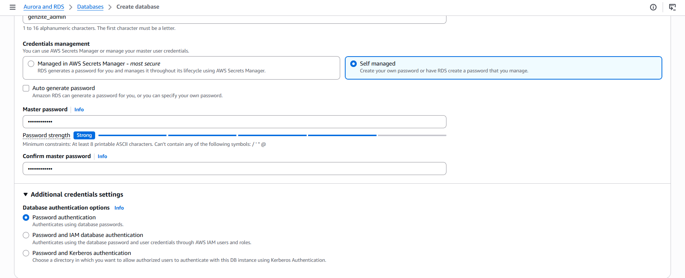
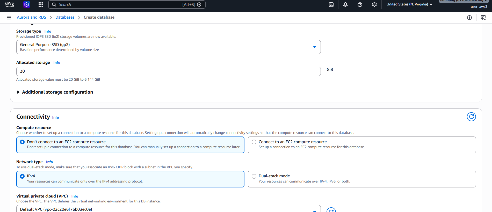
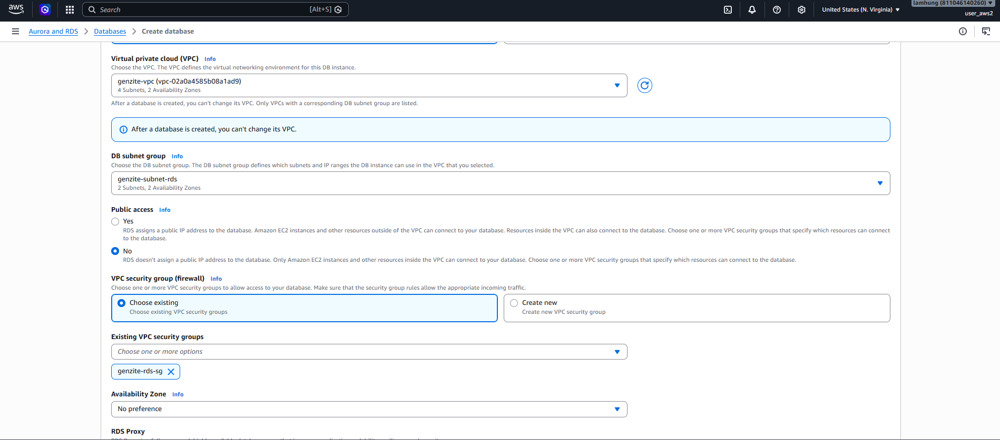
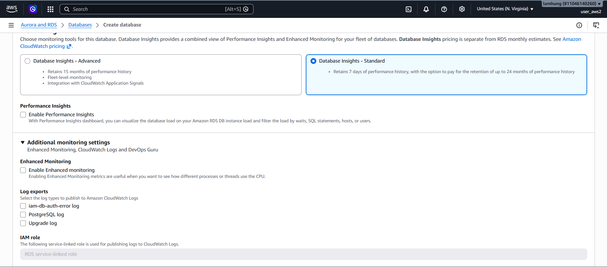
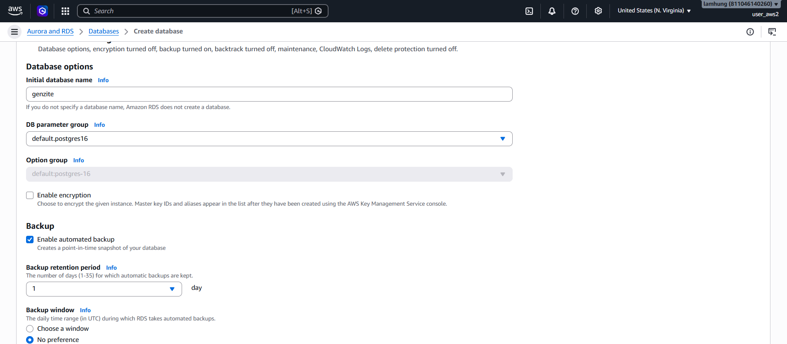

Hệ thống Genzite cần một nơi lưu trữ dữ liệu có cấu trúc (thông tin User, các Project Web đã tạo, cấu trúc JSON layout). Trong môi trường AWS, dịch vụ tối ưu nhất là **Amazon Relational Database Service (RDS)**. 

Để tiết kiệm chi phí cho bài Lab và đáp ứng cấu hình MVP (Minimum Viable Product), ta sẽ chọn PostgreSQL chạy trên instance `db.t4g.micro` và đặt trong Private Subnet.

## Bước 1: Tạo DB Subnet Group

Trước khi tạo RDS, ta cần nói cho AWS biết Database này được phép nằm trong các Subnet nào. Dựa theo Security Best Practice, ta chỉ đặt DB trong Private Subnet.

1. Mở dịch vụ **RDS** trên AWS Console.
2. Từ menu bên trái, chọn **Subnet groups**.
3. Nhấn **Create DB subnet group**.
4. **Name**: `genzite-subnet-rds`.
5. **Description**: `genzite-subnet-rds`.
6. **VPC**: Chọn `genzite-vpc`.

7. Kéo xuống phần **Add subnets**:
   - Chọn **Availability Zones**: Chọn `us-east-1a` và `us-east-1b`.
   - Chọn **Subnets**: Chọn 2 **Private Subnets**

8. Nhấn **Create**.

## Bước 2: Khởi tạo Database Instance

1. Từ menu bên trái, chọn **Databases** và nhấn **Create database** và chọn **Full Configuration**

2. **Engine options**: Chọn **PostgreSQL** (Phiên bản `PostgreSQL 16.14-R2`).
4. **Templates**: Chọn **Sand box**
5. **Settings**:
   - **DB instance identifier**: `genzitedb`.
   - **Master username**: `genzite_admin`.
   - **Credentials management**: Chọn **Self managed**.
   - **Master password**: Nhập mật khẩu đủ mạnh và xác nhận lại ở ô **Confirm master password**.

6. **Instance configuration**:
   - Instance type: Chọn `db.t3.micro`.
7. **Storage**:
   - **Storage type**: Chọn **General Purpose SSD (gp2)**.
   - **Allocated storage**: `30` GiB.
   - Bỏ tích **Enable storage autoscaling** (trong phần Additional storage configuration nếu có).

8. **Connectivity**:
   - **Compute resource**: Chọn **Don't connect to an EC2 compute resource**.
   - **Network type**: Chọn **IPv4**. 

   - **Virtual private cloud (VPC)**: Chọn `genzite-vpc`.
   - **DB Subnet Group**: Chọn `genzite-subnet-rds`.
   - **Public access**: Chọn **No** (Database không được phép truy cập từ Internet).
    - **VPC security group (firewall)**: Chọn **Choose existing**, loại bỏ thẻ `default`, và chọn `genzite-rds-sg` (Đã tạo ở Lab 1 - Security).
   

9. **Database authentication**: Chọn **Password authentication**.
10. **Monitoring**:
    - **Database Insights**: Chọn **Database Insights - Standard**.
    - **Performance Insights**: Bỏ tích **Enable Performance Insights**.
    - **Enhanced Monitoring**: Bỏ tích **Enable Enhanced monitoring**.

11. Mở rộng phần **Additional configuration**:
    - **Database options**:
      - Nhập **Initial database name**: `genzite`. *(Nếu không nhập ô này, RDS sẽ không tạo sẵn Database cho bạn)*.
      - **DB parameter group**: Chọn `default.postgres16`.
    - **Encryption**: Bỏ tích **Enable encryption**.
    - **Backup**:
      - Tích chọn **Enable automated backup**.
      - **Backup retention period**: Chọn `1 day`.

12. Kiểm tra lại thông tin, cuộn xuống dưới cùng và nhấn **Create database**.

## Bước 3: Lấy Endpoint kết nối

Quá trình khởi tạo Database có thể mất từ 5-10 phút.

1. Khi trạng thái Database chuyển sang `Available`, hãy nhấn vào tên `genzite-db`.
2. Trong tab **Connectivity & security**, tìm mục **Endpoint**.
3. Sao chép lại đường dẫn **Endpoint** này (ví dụ: `genzite-db.xxxxxxxxx.us-east-1.rds.amazonaws.com`). 

Bạn sẽ cần Endpoint này cùng với Username, Password và Tên database (`genzite`) để cấu hình cho máy chủ Backend EC2 ở bước tiếp theo.
