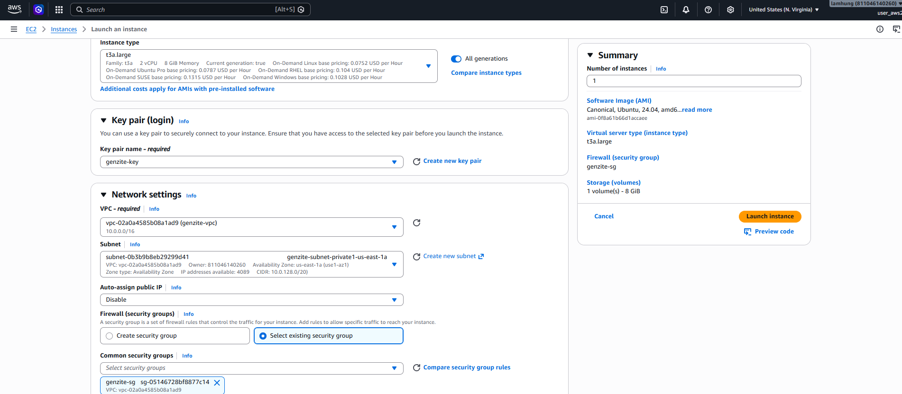
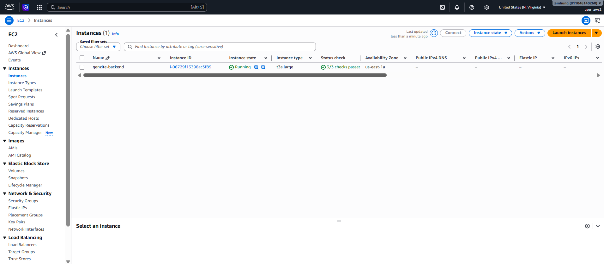
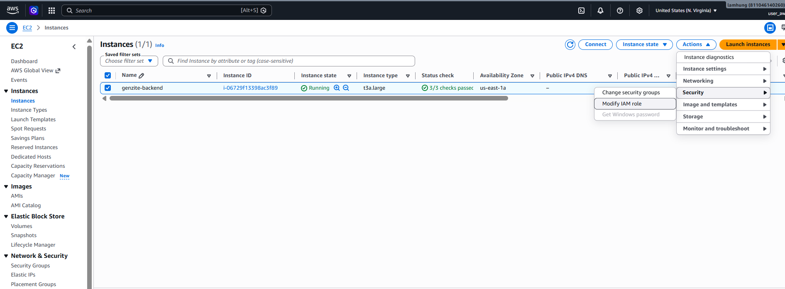
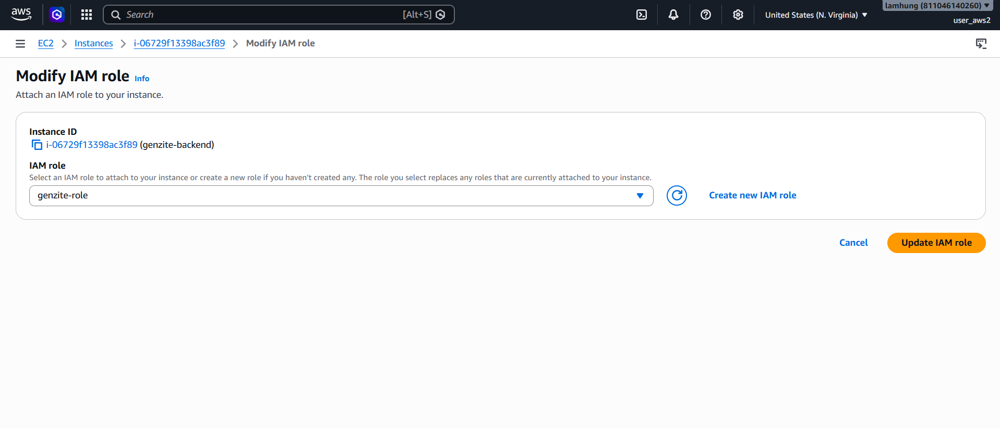

Để ứng dụng Genzite xử lý các request phức tạp (sinh JSON từ prompt, giao tiếp với Database), chúng ta cần một máy chủ ảo (Virtual Machine). Trong AWS, đó là dịch vụ **Amazon Elastic Compute Cloud (EC2)**.

Dựa theo thiết kế, EC2 sẽ được đặt trong **Private Subnet** để ẩn khỏi internet, và chỉ cho phép lưu lượng truy cập đi qua Application Load Balancer (ALB).

## Bước 1: Khởi tạo EC2 Instance

1. Mở dịch vụ **EC2** trên AWS Console.
2. Nhấn **Launch instances**.
3. **Name**: Nhập `genzite-backend`.
4. **Application and OS Images (Amazon Machine Image)**:
   - Chọn **Ubuntu**.
   - Chọn **Ubuntu Server 24.04 LTS**.
5. **Instance type**:
   - Chọn `t3a.large`.
6. **Key pair (login)**:
   - Chọn **Create new key pair** với tên `genzite-key`.
7. **Network settings**:
   - Nhấn **Edit**.
   - **VPC**: Chọn `genzite-vpc`.
   - **Subnet**: Chọn một **Private Subnet**.
   - **Auto-assign public IP**: **Disable**.
   - **Firewall (security groups)**: Chọn **Create security group**.
   - **Security group name**: `genzite-sg`.

8. **Configure storage**:
   - Tăng dung lượng từ `8` lên `30` GiB.
9. Các phần còn lại giữ nguyên. Nhấn **Launch instance**.

## Bước 2: Thêm IAM Role cho EC2

1. Quay về trang chủ **EC2** chọn **genzite-backend**, chọn **Actions**,chọn **Sercurity** rồi **Modify IAM role**.

2. Thay đổi IAM role thành role **genzite-role**.
3. Nhấn **Update IAM role**.

4. Quay lại trang **EC2**, Tiến hành **Reboot** lại EC2 và đợi trong giây lát.
5. Như vậy là đã thêm quyền xong cho EC2.


## Bước 3: Kết nối và Cài đặt Môi trường (Docker, Node.js)

1. Sau khi reboot, chọn lại EC2 và nhấn **Connect**.
2. Chuyển qua tab **Session Manager** và kéo xuống chọn **Connect**.
3. Trong terminal, test thử với lệnh `whoami` (nếu trả về `ssm-user` là chính xác).
4. Tiến hành chạy các lệnh sau để cập nhật hệ thống và cài đặt môi trường:

```bash
sudo apt update
sudo apt update && sudo apt upgrade -y

# Cài đặt Docker
sudo apt install -y docker.io
docker --version
sudo systemctl enable docker
sudo systemctl start docker
sudo systemctl status docker
```
*(Nhấn `Ctrl + C` để thoát khỏi màn hình status của Docker)*

Tiếp tục cài đặt Docker Compose và Git:
```bash
sudo apt install -y docker-compose-v2
docker compose version

sudo apt install -y git
git --version
```

## Bước 4: Tải Source Code và Chạy Ứng Dụng

Chuyển sang quyền root để tải code và chạy dự án:
```bash
sudo -i
git clone https://github.com/KrisCTer/Genzite
cd Genzite

# Cài đặt Node.js 22.x
curl -fsSL https://deb.nodesource.com/setup_22.x | sudo -E bash -
sudo apt install -y nodejs
node -v
npm -v

# Cài đặt pnpm
sudo npm install -g pnpm
pnpm install
pnpm run build:packages

# Cấu hình biến môi trường
cd infra
cp .env.example .env

# Khởi chạy các dịch vụ hạ tầng với Docker Compose
docker compose up -d db cache zookeeper kafka
cd ..

# Migrate database
pnpm run prisma:migrate

# Khởi chạy các microservices của dự án (chạy ngầm với nohup)
nohup pnpm run dev:gateway > gateway.log 2>&1 &
nohup pnpm run dev:ai > ai.log 2>&1 &
nohup pnpm run dev:data > data.log 2>&1 &
nohup pnpm run dev:identity > identity.log 2>&1 &
nohup pnpm run dev:media > media.log 2>&1 &
nohup pnpm run dev:site > site.log 2>&1 &
nohup pnpm run dev:notification > notification.log 2>&1 &
nohup pnpm run dev:frontend --host 0.0.0.0 > frontend.log 2>&1 &
```
