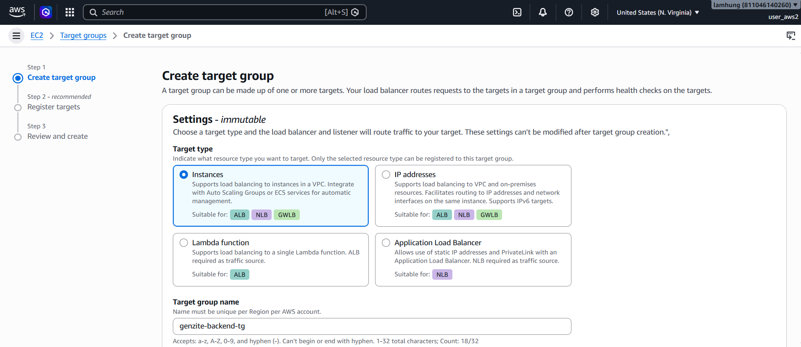
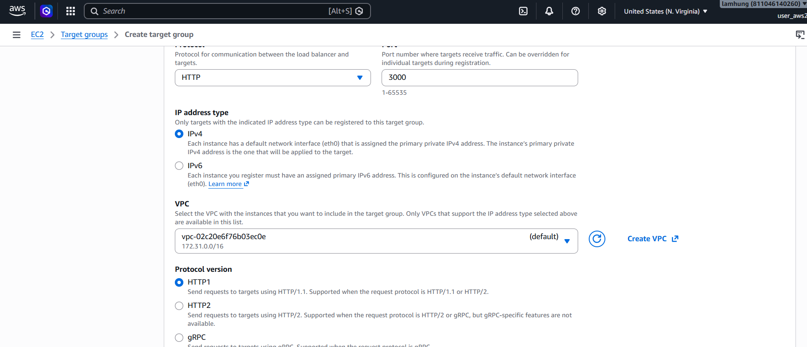
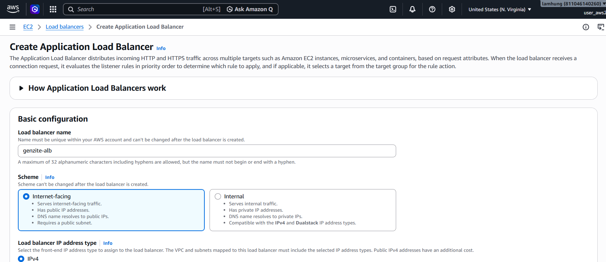
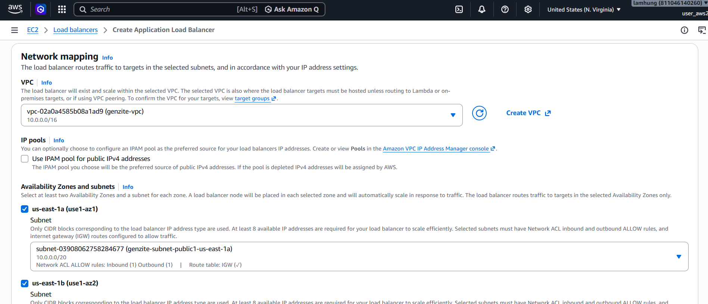
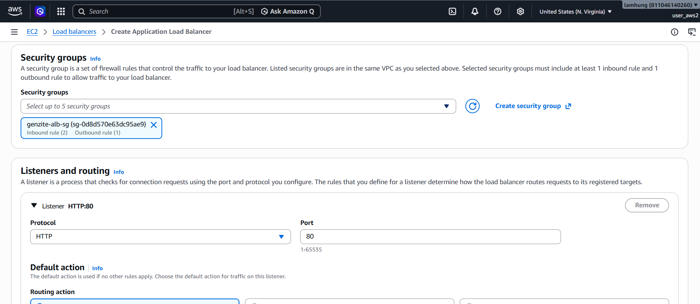
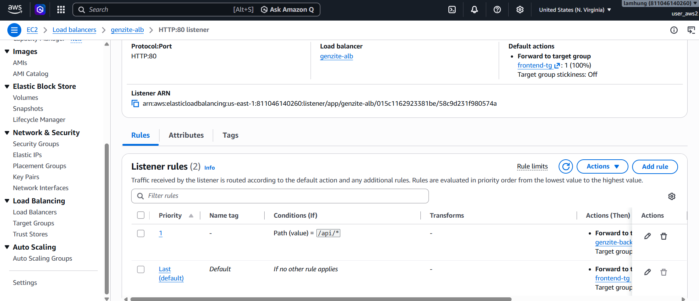

Because the EC2 Backend server resides in a **Private Subnet** (with no Public IP), frontend applications from the internet cannot call our APIs directly.

The AWS standard solution is to use an **Application Load Balancer (ALB)** placed in the Public Subnets. The ALB receives HTTP/HTTPS requests from the internet and securely "forwards" them to the EC2 instances inside.

## Step 1: Create Target Groups

A Target Group is a logical group containing the servers (EC2 instances) that the ALB will route traffic to. We will create two Target Groups: one for the Backend and one for the Frontend.

### 1.1. Create Target Group for Backend
1. Open the **EC2** service, scroll down the left menu to **Load Balancing**, and select **Target Groups**.
2. Click **Create target group**.
3. **Choose a target type**: Select **Instances**.
4. **Target group name**: `genzite-backend-tg`.

5. **Protocol**: `HTTP`. **Port**: `3000` (The port where the Backend API is running).
6. **VPC**: Select `genzite-vpc`.
7. **Health checks**: Leave the defaults (Protocol: HTTP, Path: `/`).
   *(Note: Ensure your API has a route that returns a 200 status code at the root path `/` for the health check to pass).*

8. Click **Next**.
9. On the **Register targets** screen, select your `genzite-backend` instance from the list below.
10. Change the port to `3000` and click **Include as pending below**.
11. Scroll down and click **Create target group**.

### 1.2. Create Target Group for Frontend
1. From the **Target Groups** screen, click **Create target group** again and create similarly to **genzite-backend-tg**.
2. **Choose a target type**: Select **Instances**.
3. **Target group name**: `frontend-tg`.
4. **Protocol**: `HTTP`. **Port**: `5173` (The port where the Frontend is running).
5. **VPC**: Select `genzite-vpc`.
6. **Health checks**: Leave the defaults (Protocol: HTTP, Path: `/`).
7. Click **Next**.
8. On the **Register targets** screen, select your `genzite-backend` instance from the list below.
9. Ensure the port is `5173` and click **Include as pending below**.
10. Scroll down and click **Create target group**.

## Step 2: Initialize Application Load Balancer

1. Access the **EC2** service, and in the left menu, select **Load Balancers**.
2. Click **Create load balancer**.
3. Choose **Application Load Balancer** and click **Create**.
4. **Load balancer name**: `genzite-alb`.
5. **Scheme**: Select **Internet-facing**.

6. **Network mapping**:
   - **VPC**: Select `genzite-vpc`.
   - **Mappings**: Select 2 **Availability Zones** and correspondingly select 2 **Public Subnets**.

7. **Security groups**:
   - Select `genzite-alb-sg`. (Ensure it has inbound rules allowing HTTP/HTTPS).
8. **Listeners and routing**:
   - **Protocol**: `HTTP`. **Port**: `80`.
   - **Default action**: Select Target group `frontend-tg` (to route to Frontend).
   
9. Leave the remaining settings as default and click **Create load balancer**.

## Step 3: Configure API Routing Rule

To route requests starting with `/api/*` to the Backend instead of the Frontend, we will add a Rule to the ALB.

1. Select the newly created `genzite-alb` Load Balancer.
2. Under the **Listeners and rules** tab, click on the `1 rule` section (or click directly on the HTTP:80 listener).
3. Select the **Default** rule and click **Add rule**.
4. In the **Conditions** section, click **Add condition**, select **Path**, and enter the value `/api/*`.
5. Scroll down to the **Actions** section, choose **Forward to**, and select the `genzite-backend-tg` Target Group.
6. Under **Rule priority**, set the Priority to `1`.
7. Click **Add rule** to save.
   

Once created successfully, your ALB is ready to route UI traffic to the Frontend, and data traffic to the Backend!

---
**Lab 3 Complete!** You now possess a fully functional Backend infrastructure consisting of a secure Database, a protected EC2 server, and an intelligent ALB router. Let's head over to **Lab 4** to integrate artificial intelligence (Gemini API).
